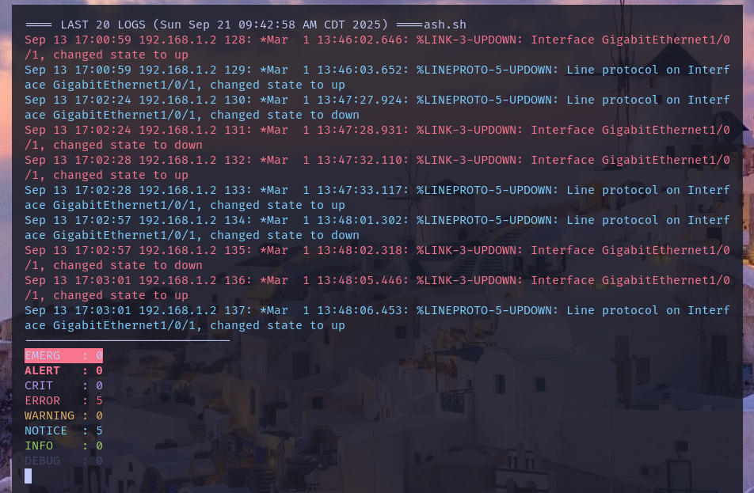

# Syslog-summary

## Overview:
A minimal Bash tool that displays the latest syslog entries in real time, highlights severity levels with colors, and shows message counts.



## Features
- Tails a log file (e.g. /var/log/syslog or device-specific logs).
- Highlights severity levels (EMERG … DEBUG) using ANSI colors.
- Counts how many messages of each severity appeared in the last N lines [].
- Auto-refreshing terminal view (like a mini dashboard).

## Usage:
**First of all, you have two options for where your logs should come from:**

**1. Standard system log (/var/log/syslog)**
By default, traffic from your network appliances (routers, switches, PCs, etc.) is written into the system’s main syslog file.
Problem: these messages get mixed with all other system logs, which can be messy.

**2. Dedicated log file (recommended)**
You can configure rsyslog to send messages from a specific device (by IP or hostname) into a separate file.
This keeps your appliance logs organized and easier to monitor/read.

Example: create ```/etc/rsyslog.d/switch1.conf```:

```
Match logs from switch at 192.168.1.10
if ($fromhost-ip == '192.168.1.10') then /var/log/cisco-switch1.log
& stop
```
Then restart rsyslog:
```sudo systemctl restart rsyslog```

Now all logs from 192.168.1.10 will go into:
 ```/var/log/cisco-switch1.log```.

## Run the script

Clone repo and make it executable using chmod:
``` 
git clone https://github.com/NTPriest/sysdash.git
cd sysdash
chmod +x sysdash.sh
```

Run it (default log file is ```/var/log/cisco-switch1.log```, but you can change name log file tho):

```./sysdash.sh```

## Configuration
``` 
LOG="/path/to/logfile"   # default: /var/log/cisco-switch1.log
LINES=20                 # how many recent log lines to display
SLEEP=5                  # refresh interval in seconds
```

## Tips
- If your terminal gets cluttered, press `Ctrl + L` to clear the screen.  
- Then execute the script again:  
  ```bash
  ./sysdash.sh

## Requirements
- Bash
- Standard tools: awk, tail, tput, sleep

## License
MIT
